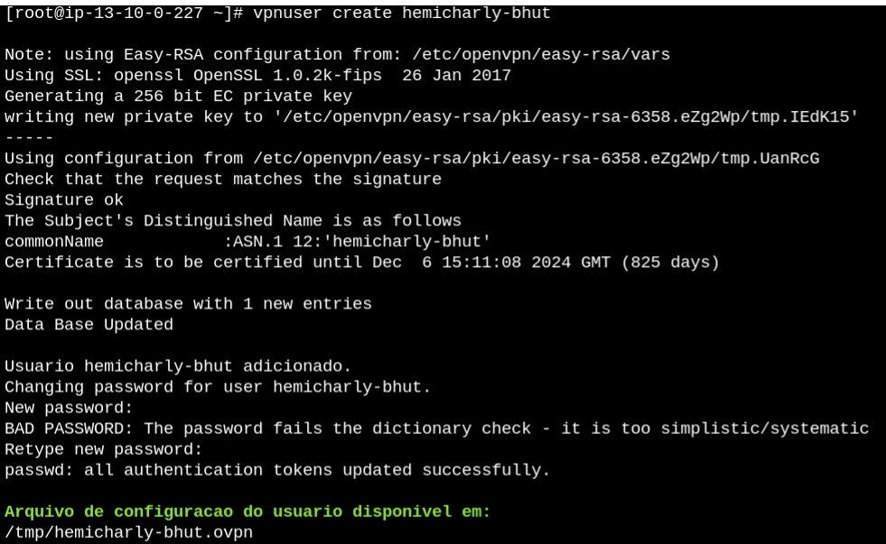

# Bhut-OpenVPN-Server

Este projeto tem como finalidade provisionar um servidor OpenVPN em uma EC2 na AWS

#### 1. Requisitos necessários

- Terraform ~> 4.15.0
- Aws CLI
- Makefile

#### 2. Recursos que este script provisionará na AWS

* Lista de recursos

| RECURSO             | QUANTIDADE | DESCRIÇÃO                                                                                                                                            | 
|---------------------|------------|------------------------------------------------------------------------------------------------------------------------------------------------------|
| VPC                 | 1          | Provionado pelo modulo VPC (*OPCIONAL, caso tenha outra VPC pronta*)                                                                                 |
| SUBNET PUBLIC       | 2          | Provionado pelo modulo VPC (*OPCIONAL, caso tenha outra VPC pronta*)                                                                                                              |  
| SUBNET PRIVATE      | 2          | Provionado pelo modulo VPC, (*OPCIONAL, caso tenha outra VPC pronta*)                                                                                                             |  
| ROUTE TABLE PUBLIC  | 1          | Para associar as subnets publicas, provionado pelo modulo VPC (*OPCIONAL, caso tenha outra VPC pronta*)                                                                           |  
| ROUTE TABLE PRIVATE | 1          | Para associar as subnets privadas, provionado pelo modulo VPC (*OPCIONAL, caso tenha outra VPC pronta*)                                                                           |  
| INTERNET GATEWAY    | 1          | Provionado pelo modulo VPC (*OPCIONAL, caso tenha outra VPC pronta*)                                                                                                              |  
| NAT GATEWAY         | 1          | Pode ser customizado para não criar, provionado pelo modulo VPC (*OPCIONAL, caso tenha outra VPC pronta*)                                                                         |  
| NAT EIP             | 1          | Obrigatório caso tenha NAT GATEWAY, provionado pelo modulo VPC (*OPCIONAL, caso tenha outra VPC pronta*)                                                                          |  
| EC2                 | 1          | Criado uma EC2  `Amazon Linux 2` do tipo `t3.micro`, provionado pelo modulo VPN (*OBRIGATÓRIO*)                                                      |  
| Security Group      | 1          | Grupo de Segurança da EC2, liberando acesso para internet aos protocolos `TCP` e `UDP` para porta `1194`, provionado pelo modulo VPN (*OBRIGATÓRIO*) |  
| IAM Roles           | 1          | Criado permissão para EC2 acessar os recursos `AmazonSSMManagedInstanceCore` e `AmazonS3FullAccess`, provionado pelo modulo VPN (*OBRIGATÓRIO*)      |  

**OBSERVAÇÃO:** Caso for utilizar apenas o modulo `vpn`, basta utilizar apenas o script do arquivo `./terraform/vpn.tf` e remover o arquivo `./terraform/vpc.tf`:
```bash
module "openvpn" {
  source                 = "./vpn"
  name                   = "openvpn"
  region                 = var.region
  ami                    = "ami-05fa00d4c63e32376" # Amazon Linux 2 latest version
  instance_type          = "t3.micro"
  bucket_scripts_install = "openvpn-terraform" # Mesmo bucket usado para armazenar os script do terraform
  vpc_id                 = module.vpc_openvpn.vpc_id # Pode ser substituido por id de uma VPC existente, caso não for utilizar o provisionamento da VPC 
  subnet_ids             = module.vpc_openvpn.public_subnet_ids # Pode ser substituido por ids de subnets publicas existente, caso não for utilizar o provisionamento da VPC 
  depends_on             = [module.vpc_openvpn] # Opcional caso não for utilizar o provisionamento da VPC
}
```

#### 3. Passos para provisionar os recursos na aws

* Configurações necessárias para executar o projeto

    * Inicialmente é necessario verificar no *Console da AWS* se existe o bucket no s3 com o nome **openvpn-terraform**
      na região de **us-east-1**, caso o mesmo não exista é necessario cria-lo. Este bucket é utilizado para armazenar
      os scripts do terraform, configurado no arquivo `terraform.tf`.

    * Configurar **aws cli** em `~.aws/credentials` como:

        ```bash
        [bhut]
        aws_access_key_id =
        aws_secret_access_key =
        ```

* Lista de comandos para executar o terraform

| COMANDOS         | DESCRIÇÃO                                                  | 
|------------------|------------------------------------------------------------|
| make tf-create   | Para criar recursos na aws em produção pelo terraform      |
| make tf-delete   | Para remover recursos na aws em produção pelo terraform    |   

#### 4. Passos para gerenciar o serviço OpenVPN

* Acesse o *Console da AWS* e localize a EC2 [Openvpn-Server](https://us-east-1.console.aws.amazon.com/ec2/home?region=us-east-1#Instances:instanceState=running) e faça a conexão pelo navegador usando o `Session Manager`.
* No terminal execute os seguintes comandos:
 * Alterar para modo `root` 
     ```bash
        sudo su && cd /root
      ```
 * Opções do comando `vpnuser` responsavel em gerenciar os usuários da `vpn`
   ```bash
    vpnuser
   ```
   

 * Exemplo de criação de usuário da `vpn`
   ```bash
    vpnuser create hemicharly-bhut
   ```
   
   
   **OBSERVAÇÃO:** Para fazer a configuração do `ClientOpenVPN`, basta fazer o **download** ou **copiar** o conteudo do arquivo da pasta `/tmp/<nome_usuario>.ovpn` por exemplo:
   ```bash
   cat /tmp/hemicharly-bhut.ovpn
   ```
   
 * Exemplo de listar usuários da `vpn`
   ```bash
    vpnuser list
   ```
   

 * Exemplo de remoção de usuário da `vpn`
    ```bash
    vpnuser remove hemicharly-bhut
   ```
   
